# Unslotted

Unslotted is an inventory mod that removes a portion of the slots within your inventory, turning them into an area
where it's possible to store an unlimited amount of items, with one catch: items can be dragged around and overlap, turning
an inventory with too many items into something that's difficult to sift through. So... get to organizing!

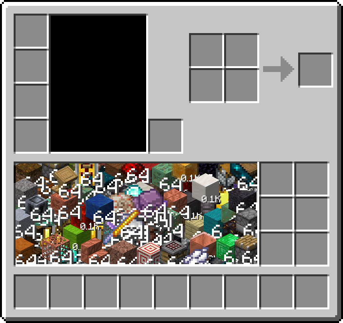

**Important note**: The mod is in *beta*. Given it's reworking how the player inventory works, it is a dangerous mod
to be used in long-term worlds, and may not be fully stable yet. Specifically, the mod currently still stores much of
its data inside player NBTs directly, and doesn't break packets down, meaning that *excessively large* player inventories
or slotless crates could in theory corrupt a chunk or a player.

As long as you aren't collecting industrial amounts of different types of resources, or collecting items with a lot of NBT
information, you will probably never reach a dangerous point, but it's good to keep it in mind. These things will be fixed
over time! Once I'm confident enough in the mod, I will take it out of beta, but until then, make frequent backups of your worlds,
and update the mod with care.

## Other Content

### Slotless Crate

Alongside your inventory, there is also a new block, called the slotless crate, which works much like your inventory, but
as a storage block instead:

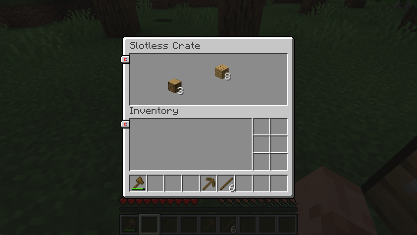

You can move items from one container to another by just dragging them around:

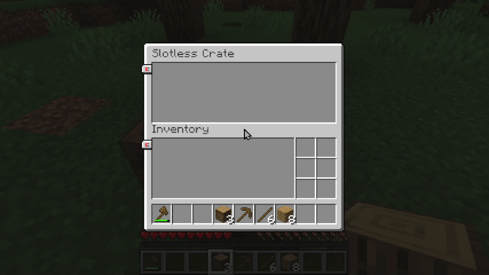

The recipe of the slotless crate is four planks on each corners, and four sticks in between all the planks:

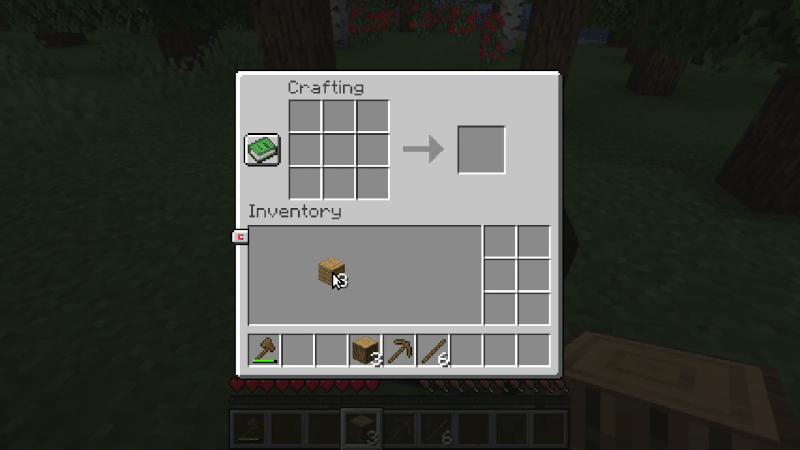

### Item Cluster

If a player dies, or a slotless crate gets destroyed, instead of dropping all items on the ground (which, depending on the
amount of items, might kill a server), the *item cluster* gets dropped instead, which may then be used on a slotless crate
or on yourself, to retrieve the items! The Item Cluster *should* be compatible with gravestone mods (Though I obviously
have not tested them all):

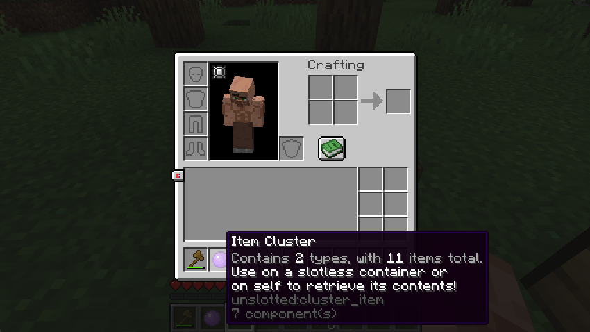

Using it on a slotless crate:

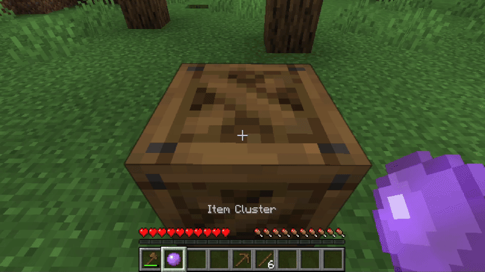

Using it on self:

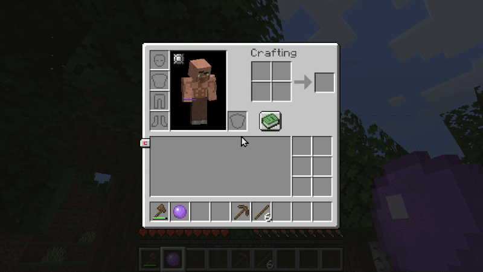

### Reset Magnet

There is a button in the corner of the slotless inventory, which when clicked, will pull all items that are *outside* your
view of the inventory, and thus impossible to grab. If you ever lose an item by dragging them outside, just click there!

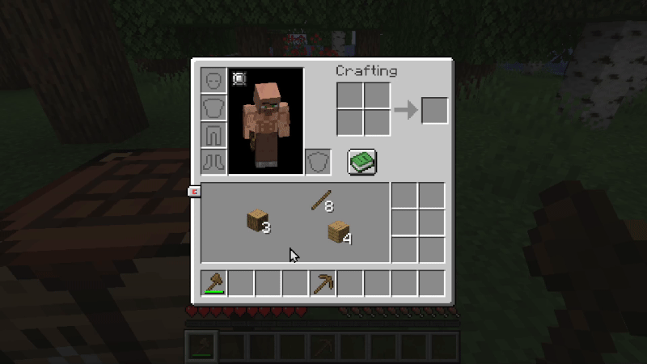

If you hold shift, you will reset the positions of *all* items in your inventory:

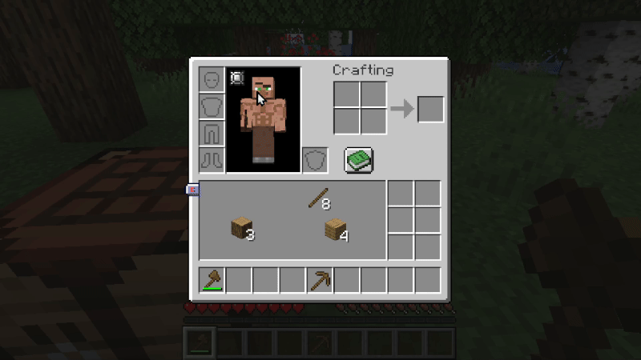

## Demonstration

Here are some gifs showing actual usage of the mod! Keep in mind the mod is a modification of one of the core systems
of the game, so incompatibilities are bound to be found. I will try to keep them to a minimum however, and fix them
as I find them! The mod should feel as close as possible to the player's vanilla inventory in most of its interactions, and
also be compatible with modded GUIs that show the player's inventory (Although it will look weird if the modded GUI does not
follow minecraft's art style. I have a few ideas on how to "fix" it, but they are definitely experimental).

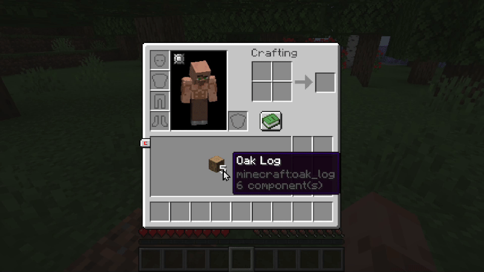
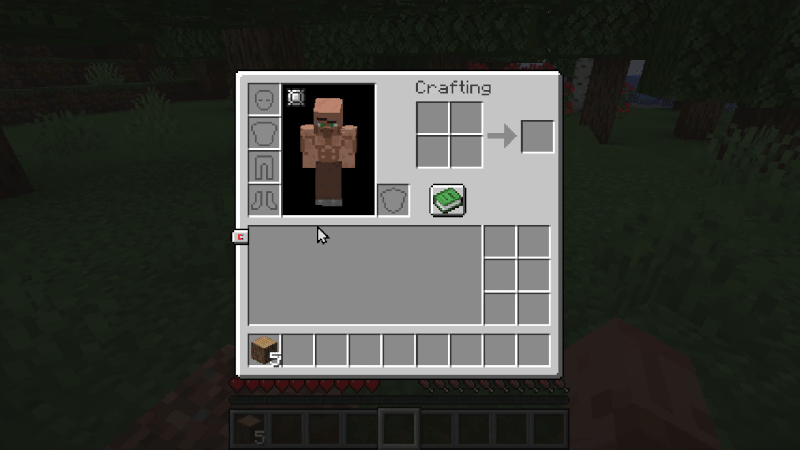

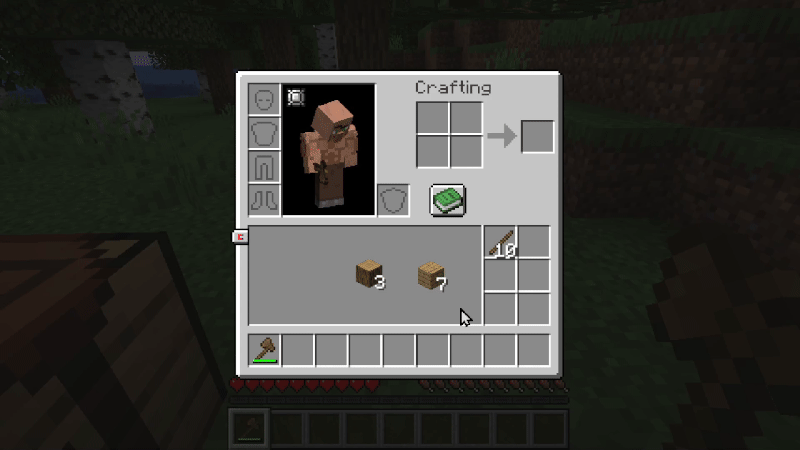
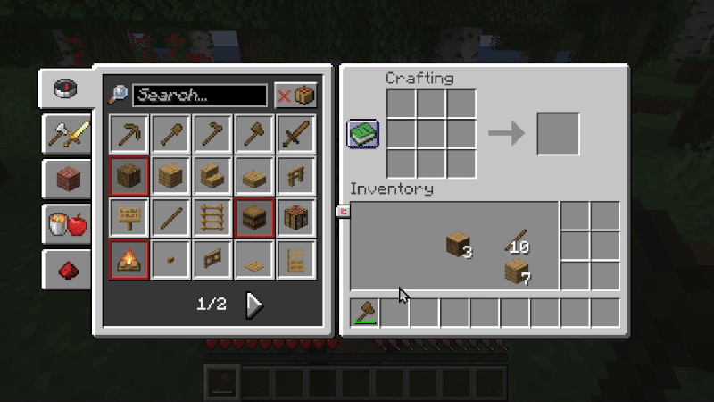
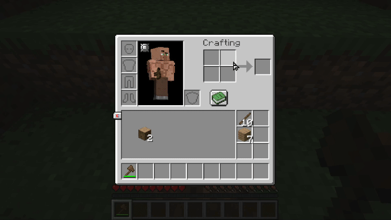